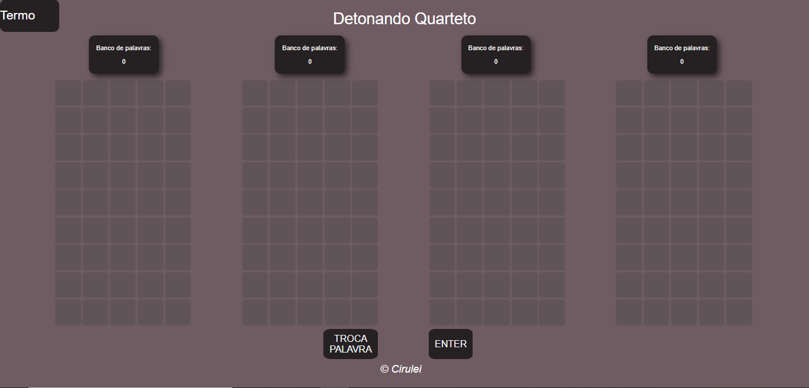

# Detonando-termo-site
    Código que resolve os jogos de palavra Letreco e Termo AGORA EM SITE!

- [Projeto Python](https://github.com/Rafael-Cirino/Detonando-letreco-termo)

- [Site do detonado](https://detonando-termo.herokuapp.com/index.html)

    - [Vídeo detonando termo](https://youtu.be/qvRWoiUZhuc)
    - [Vídeo detonando dueto](https://youtu.be/p7SsHZOADMc)
    - [Vídeo detonando quarteto](https://youtu.be/8RyhLu3HO68)

## Objetivo
Asistindo as lives do [Casimiro](https://www.youtube.com/c/CortesdoCasimitoOFICIAL) jogando [Letreco](https://www.gabtoschi.com/letreco/) e [Termo](https://term.ooo/), pensei por que não fazer um código que resolve estes jogos. Deixo bem claro aqui que o objetivo não é trapacear, mas desenvolver lógica e conhecimentos de programação

## Sobre os jogos
Os dois jogos são similares, todo dia eles lançam uma nova palavra que contém 5 letras e o objetivo do jogador é encontrar a palavra daquele dia em até 6 tentativas. Conforme o jogador vai arriscando qual é a palavra do dia, o sistema vai fornecer qual letra da palavra está na posição correta **(VERDE)** e qual está contida na palavra, mas não na posição certa **(AMARELO)**

### Dueto e quarteto
Visando aumentar a dificuldade do jogo, o site termo lançou duas novas versões, onde é necessário encontrar 2 palavras(Dueto) e 4 palavras(Quarteto). Mas para o azar deles, a versão em site do detonado ainda estava em desenvolvimento, e já temos detonados tanto para o Dueto quanto para o Quarteto, os vídeos acima demonstram como jogar.

## Run
Basta acessar o [site do detonado](https://detonando-termo.herokuapp.com/index.html)

## Como usar o detonado

A interface é exatamente como demonstrado na imagem abaixo, para utilizar o app segue o passo a passo:

1. Clicar no botão **ENTER**
2. A palavra gerada aleatóriamente irá aparecer, digitar ela no Letreco ou termo
    1. Caso a palavra não seja encontrada, pode clicar no botão **TROCAR PALAVRA**
3. Depois de digitar a palavra no Letreco ou Termo e visualizar quais são as posições da palavra.
    1. Caso amarelo, de **1 clique** na letra para ela ficar em **AMARELO**, significando que está na palavra final, só não se sabe a posição.
    2. Caso verde, de **2 cliques** na letra para ela ficar em **VERDE**, significando que está na palavra final e nesta posição.
4. Após passar o gabarito para o app, seguir do passo 1 novamente até encontrar a palavra.

- [Vídeo detonando termo](https://youtu.be/qvRWoiUZhuc)
- [Vídeo detonando dueto](https://youtu.be/p7SsHZOADMc)
- [Vídeo detonando quarteto](https://youtu.be/8RyhLu3HO68)

<figure>
    
    <figcaption>Uma demonstração da interface do site</figcaption>
</figure>

**Versão quarteto**

<figure>
    
    <figcaption>Detonando quarteto</figcaption>
</figure>

## Lógica

Na pasta Banco de palavras, há o arquivo original com todas as palavras da lingua portuguesa e o código utilizado para separar somente as que contém 5 letras e tratar elas: removendo repetições, deixando todas em minusculo e removendo caracteres especiais e acentos. Com isso temos 5428 palavras.

Com o banco de palavras formado a cada tentativa será fornecido uma palavra aleatória deste banco, retirando aquelas palavras via regex, que não tem chance nenhuma de ser a palavra do dia, desse modo, o banco de palavras inicial vai reduzindo até encontrar a palavra final.

As palavras podem ser retiradas seguindo alguns critérios:

- Todas as palavras que não contém as **letras verdes** nas suas repectivas posições
- Todas as palavras que contém as **letras amarelas** na posições que já é de conhencimento que não se encontram, e removendo palavras que não as contenham
- Remove todas as palavras que contém ao menos uma **letra cinza** da lista de bloqueio, que são aquelas que com certeza não estão na palavra final

### Lógica quarteto e dueto

Na questão de encontrar as palavras, funciona examente da mesma forma como dito acima, mas agora a mais de uma palavra ou coluna. Como a palavra fornecida sempre vai ser a mesma para todas as colunas, a dificuldade é saber qual palavra fornecer.

O código foi desenvolvido para buscar a palavra de forma aleatória no menor banco de palavras que existe. Ele compara palavra por palavra com os outros bancos de palavras, e vai sempre buscar sugerir aquela que possui mais letras em comuns com palavras dos outros bancos. Importante ressaltar que a prioridade sempre será do menor banco, com o objetivo de encontrar as palavras o mais rápido possível.

No dueto podemos usar essa mesma lógica, portanto, para jogar ele basta utilizar somente as duas primeiras colunas, travando as duas últimas ao selecionar a primeira palavra como correta em ambas.

## Resultados

No [projeto Python](https://github.com/Rafael-Cirino/Detonando-letreco-termo), há o código **termo_auto.py** que testa a lógica(mesma utilizada em Js) de encontrar a palavra correta para n tentativas, abaixo se encontra os resultados destes testes:

| **n tentativas** 	| **% de acerto** 	| **Média de tentativas até acertar** 	|
|------------------	|:---------------:	|:-----------------------------------:	|
| 10               	|       100%      	|                 4,3                 	|
| 100              	|       95%       	|                 3,87                	|
| 1000             	|      95,1%      	|                 3,76                	|
| 10000            	|      95,6%      	|                 3,76                	|